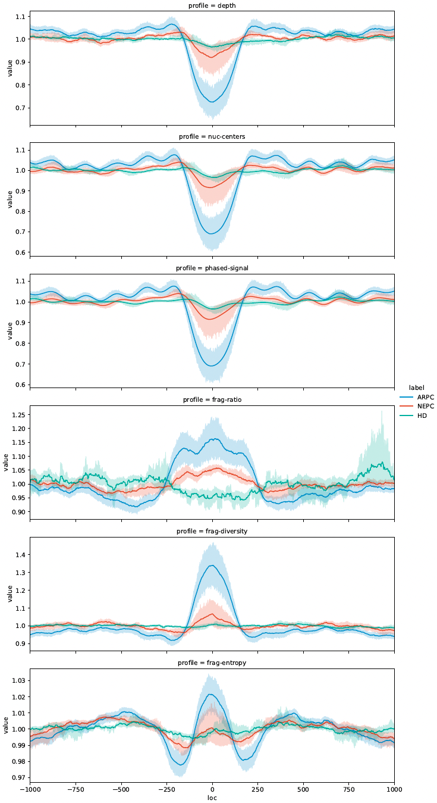
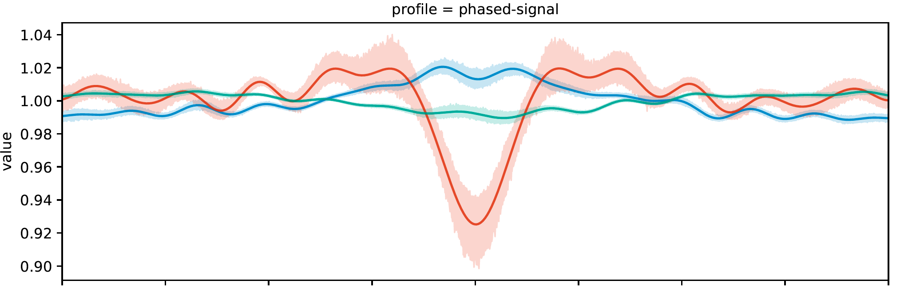
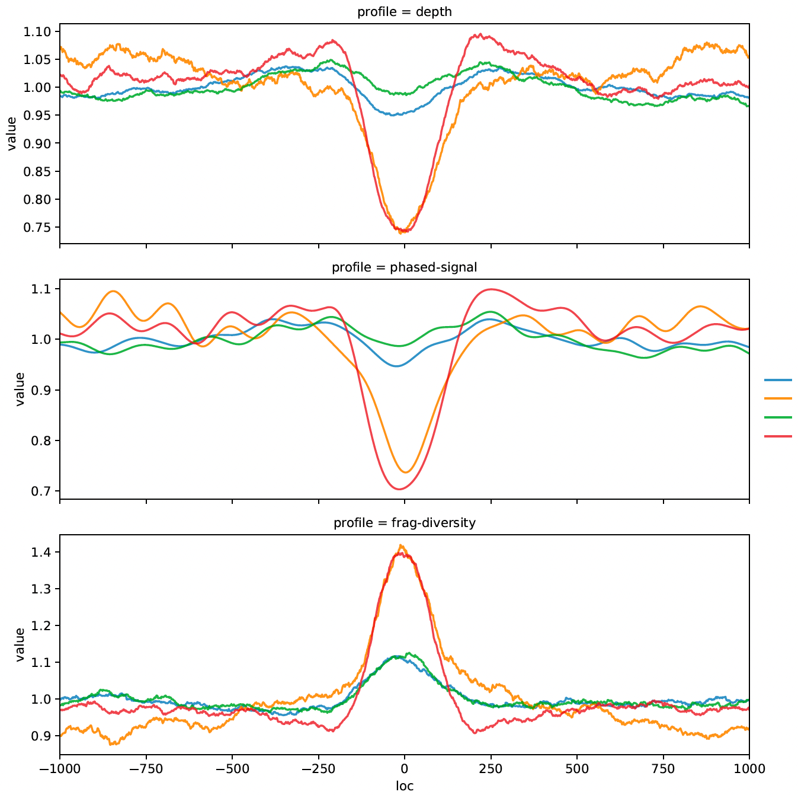

# Triton 
As a cell free DNA (cfDNA) processing pipeline, Triton conducts fragmentomic and phased-nucleosome coverage analyses on individual or
composite genomic regions and outputs both region-level biomarkers and nt-resolution signal profiles, with optional purity correction.

_Triton_ is named for the Greek deity who served as messenger of the deep and would blow a conch shell to calm or raise the waves.
Like Triton, this tool has the power to see beyond the waves and carry messages from the deep.
<br/><br/>

## Description
Triton conducts nucleotide-resolution profile analyses for cfDNA samples in BAM format, given a list of individual regions of interest (BED containing,
for example, promoter regions or gene bodies) or list of composite regions of interest sharing a common center (list of BED files each containing, for
example, binding locations for a single transcription factor). All fragments in each region/composite region are used to find the fragment size
distribution, coverage, and probability of a nucleosome center at each point. GC bias correction files from Griffin† are used for GC correction by default,
though alternative methods are supported. Finally Fast Fourier Transforms are used to isolate well-phased nucleosome derived signal, from which specific features are drawn.

Updates in Version 3 (v0.3.1):
* Updated NCDict.pkl used for probable nucleosome center re-weighting of fragment coverage [(see nc_info)](#nc_info)
* New background panel creation/subtraction modes to account for tumor purity [(see panel_info)](#panel_info)
* Methylation mode, which accepted Bismarck output files as inputs, has been discontinued (see version 0.2.2)
* Triton now outputs a fragment end profile instead of the probable nucleosome center profile, which was generally redundant with the phased-nucleosome profile
* All operations in Triton now use numpy arrays exclusively, leading to an increase in efficiency
* Updated annotation files for transcription start sites (TSS), transcript bodies, and composite transfription factors [(see inputs)](#inputs-extra-details)
* Window size for window and composite-window modes now defaults to +/-1000 bp (2000 bp)
* Bands of coverage without enough overlapping fragments to perform fragmentomics analyses now return 0s as opposed to NaNs

### Outputs

Triton signal profiles are output as NumPy compressed files (.npz), one for each sample, containing one NumPy array object for each queried
(individual or composite) site. E.g. if 100 composite site lists are passed with a window size of 2000bp, each output file will contain
100 named arrays, each with shape 2000x11.

Nucleotide-resolution profiles include:

    1: Coverage/Depth (GC-corrected)  
    2: Fragment end coverage/depth
    3: Phased-nucleosome profile (Fourier-filtered probable nucleosome center profile)  
    4: Fragment lengths' short:long ratio (x <= 150 / x > 150)  
    5: Fragment lengths' diversity (unique fragment lengths / total fragments, i.e. multiset support / cardinality)  
    6: Fragment lengths' Shannon Entropy (normalized to window Shannon Entropy)  
    7: Peak locations (-1: trough, 1: peak, -2: minus-one peak, 2: plus-one peak, 3: inflection point)***  
    8: A (Adenine) frequency**  
    9: C (Cytosine) frequency**  
    10: G (Guanine) frequency**  
    11: T (Tyrosine) frequency**  
  
Triton region-level features are output as a .tsv file and include:

    site: annotation name if using composite sites, "name" from BED file for each region otherwise  
        ### Fragmentation Features (using all fragments in passed range/bounds) ###  
    fragment-mean: fragment lengths' mean  
    fragment-stdev: fragment lengths' standard deviation  
    fragment-median: fragment lengths' median  
    fragment-mad: fragment lengths' MAD (Median Absolute Deviation)  
    fragment-ratio: fragment lengths' short:long ratio (x <= 150 / x > 150)  
    fragment-diversity: fragment lengths' diversity (unique fragment lengths / total fragments, i.e. multiset support / cardinality)  
    fragment-entropy: fragment lengths' Shannon entropy  
        ### Phasing Features (FFT-based, using >= 146bp fragments and local peak calling) ###  
    np-score: Nucleosome Phasing Score (NPS)  
    np-period: phased-nucleosome period / mean inter-nucleosomal distance  
    np-amplitude: phased-nucleosome mean amplitude  
        ### Profiling Features (Filtered signal-based, using >= 146bp fragments and local peak calling) ###  
    mean-depth: mean depth in the region (GC-corrected, if provided)  
    var-ratio: ratio of variation in total phased signal (max signal range : max signal height)  
    plus-one-pos*: location relative to central-loc of plus-one nucleosome  
    minus-one-pos*: location relative to central-loc of minus-one nucleosome  
    plus-minus-ratio*: ratio of height of +1 nucleosome to -1 nucleosome  
    central-loc*: location of central inflection relative to window center (0)  
    central-depth*: phased signal value at the central-loc (with mean in region set to 1)  
    central-diversity*: mean fragment diversity value in the +/-5 bp region about the central-loc (with mean in region set to 1)  

 N.B. that np-amplitude, var-ratio, and fragment diversity measures (fragment-diversity, fragment-ent, and central-diversity) are sensitive to
 sequencing depth and will be increasingly inversely correlated with sample coverage at low depths.

 When run in composite mode Triton will also output a SkippedSites.bed for each samples, containing individual site
 coordinates for sites skipped due to insufficient or outlier coverage (MAD > 10 in any region). This file will share the format
 of whatever input is provided with additional "reject_reason" and "site_ID" columns. These sites may then be run in individual mode
 (in which case modifications in the "name" column may be required if identical between sites) to examine reason for removal.
  
\* these features are only output if a window mode is used, otherwise np.nan is reported  
\** sequence is based on the reference, not the reads (nt frequency, in composite mode)  
\*** minus-one, plus-one, and inflection locs are only called if a window mode is used, and supersede peak/trough  

### Uses

Triton may be used either as an endpoint in cfDNA data analysis by outputting ready-to-use features from a given list of regions or
composite regions, or as a processing step for further feature extraction from output profiles. Features reported directly from
Triton can be used in traditional machine learning approaches, specific profiles may be plotted with accompanying scripts for
qualitative analysis, or profile outputs may be utilized in signal-based analyses and learning structures, e.g. Convolutional Neural Networks (CNNs). 
Triton features have already been used to distinguish heterogenous cancer lineages via [Keraon](https://github.com/denniepatton/Keraon), and output
profiles of TSSs in conjunction with features from matched gene bodies are utilized in [Proteus](https://github.com/denniepatton/Proteus) to predict
individual genes' expression directly from cfDNA (see [publications](#publications)).


### Publications

[Nucleosome Patterns in Circulating Tumor DNA Reveal Transcriptional Regulation of Advanced Prostate Cancer Phenotypes](https://doi.org/10.1158/2159-8290.CD-22-0692)

## Usage

Triton may be incorporated directly into scripts, or run on a remote cluster using the provided Snakemake(s).
See below for usage details:

### Inputs to Triton.py:

```
-n, --sample_name		: sample identifier (string, required)  
-i, --input			: input .bam file (path, required)  
-b, --bias			: input-matched .GC_bias file (path, e.g. from Griffin†, required)  
-a, --annotation		: regions of interest as a BED file or text file containing a list of BED file paths (required)  
-g, --reference_genome		: reference genome .fa file (path, required)  
-r, --results_dir		: directory for output (path, required)  
-m, --run_mode			: run mode ("region", "window", or "composite-window", string, required)  
-q, --map_quality		: minimum read mapping quality to keep (int, default=20)  
-f, --size_range		: fragment size range in bp to keep (int tuple, default=(15, 500))  
-c, --cpus			: number of CPUs to use for parallel processing of regions (int, optional)  
-d, --frag_dict			: dictionary of probable nucleosome center locations (displacements within fragments) for given fragment  
				  lengths, as a Python binary .pkl file. Triton ships with a pre-computed dictionary in nc_info/NCDict.pkl,  
				  which is called by default. See nc_info for details. (optional, default='../nc_info/NCDict.pkl')  
-s, --subtract_background_panel	: path to an annotation-matched background panel for subtraction (string, optional)  
-t, --tumor_fraction		: tumor fraction, required if the -s (--subtract_background_panel) flag is not None (float, optional)  
-p, --generate_panel		: run in background panel generation mode (bool, optional)
```

### Inputs (extra details):

**input:** input .bam files are assumed to be pre-indexed with matching .bam.bai files in the same directory  

**bias:** sample-matched .GC_bias files can be generated using Griffin's GC correction method
available at (<https://github.com/GavinHaLab/Griffin>) or using any other method, so long as the format matches.
Format: tab-seperated file with columns "length", "num_GC", and "smoothed_GC_bias" which contains all combinations of
fragment length / GC content ([0, fragment length]) for a given sample, each with an associated bias.

**annotation:** for individual mode this should be a single [bed-like file](https://www.genome.ucsc.edu/FAQ/FAQformat.html#format1) which contains,
at minimum, the following columns: [chrom chromStart chromEnd name/Gene]. If strand is provided that will be used to orient all sites in the positive
direction; otherwise individual regions will be treated as belonging to the + strand, while composite regions will have a strand randomly selected.
If a window or composite-window mode is used, a "position" column must also be included, which defines the central point for the window.
When run in composite-window mode, instead of passing a single bed-like file, a text file containing a list of bed-like file locations is needed;
each individual file is treated as one composite-site, with reads "piled up" across all regions based on stacking fragments in each window.
Because a defined window is required for composite-window mode, each bed-like file should contain the additional "position" column.  

An example canonical (MANE) transcript body annotation is included in config/site_lists/MANE.GRCh38.v1.3_TranscriptBodies.bed and is suitable for **region** mode.  

An example canonical (MANE) transcription start site annotation is included in config/site_lists/MANE.GRCh38.v1.3_TSS.bed and is suitable for **window** mode.  

Example TFBS-BED file lists are provided in config/site_lists/GTRD_F1000.tsv and config/site_lists/GTRD_F10000.tsv; they link to BEDs in
config/site_lists/GTRD_F1000 and GTRD_F10000 respectively and contain 1,000 and 10,0000 top sites for 414 TFBSs, garnered from GTRD, filtered,
and then taken based on highest peak.counts. They are suitable for **composite-window** mode.  

**reference_genome:** reference genome .fa file should match whichever build the samples were aligned to.

**run_mode:** in "region" mode the full region from chromStart:chromStop is used to derive signals and features, and a BED-like annotation is required;
in "window" mode a region +/-1000 bp (2000 total) from the "position" index is used to derive signals and features for each site, and a BED-like annotation with a "position" column is required;
in "composite-window" mode pileup of multiple sites' coverage along a window as defined by "position" in window mode are used to derive signals and features for each set of sites,
and a file containing a list of BED-like annotation files containing a "position" column is required.

### Contained Scripts:

**Triton.py** | primary script containing the generate_profile() function; takes in inputs and produces outputs  
**triton_helpers.py** | contains helper functions called by Triton.py  
**triton_cleanup.py** | combines TritonFeatures.tsv output files produced by Triton when run on multiple samples; called by Snakemake(s)  
**triton_plotters.py** | plotting utils and functions for TritonProfiles.npz files; use at your own discretion or modify as you see fit!  
**triton_extractors.py** | extraction utils for producing additional custom features from signal profiles; modify as you see fit!  
**triton_panel.py** | combines multiple TritonRawPanel.npz files output from Triton.py in panel generation mode (-p) into a single site:panel background collection
**nc_dist.py** | a modified version of Triton.py for generating composite nucleosome-center profiles; see nc_info  
**nc_analyze.py** | used after nc_dist.py to create the frag_dict and plot results; see nc_info  

#### triton_plotters.py

triton_plotters.py is provided to allow for immediate plotting of TritonProfiles.npz outputs. It features four main plotting modes:

"all" plots all output signals (excluding nucleotide frequencies - here the categories option has been specified to group samples with a confidence interval):


"signal" plots only the phased-nucleosome signal:


"RSD" plots Raw (GC-corrected) coverage, phased-nucleosome Signal, and fragment Diversity:


triton_plotters.py also features options for grouping samples together, defining color palettes, signal normalization methods,
and restricting sites. It's a good place to start and modification is encouraged! Run `Python triton_plotters.py -h` for specific options and input
formatting guidance.

#### triton_extractors.py

triton_extractors.py is a bare-bones script designed to help users run their own analysis or feature extraction on TritonProfiles.npz signal outputs.
Please modify as you see fit!

### nc_info

Rather than exclude information about fragment length when producing nucleosome coverage signals, Triton attempts to
quantify the most probable nucleosome central coverage empirically when creating the "probable nucleosome center profile".
To this end "stable, tissue-independent" nucleosome positioning was garnered from NucMap (<https://ngdc.cncb.ac.cn/nucmap/>) by
overlapping 50 human iNPS peak datasets from a variety of tissue types and cell lines (<https://doi.org/10.1038/ncomms5909>)
against each other, keeping only regions represented in all samples. Triton (as nc_dist.py) was then run on the 186 remaining
high-confidence sites, using a cohort of healthy donor cfDNA from blood plasma(<https://doi.org/10.1038/s41467-019-12714-4>). The resulting
nc_info/NCDict.pkl represents a matrix of fragment length vs displacement of fragment center from nucleosome center values, renormalized,
so that the "weight" of each fragment contributing to the nucleosome center profile is adjusted at each position. The contained NCDict.pkl is
based on fitting raw counts to a triple-Gaussian: a centered distribution for capturing overlapping single nucleosomes and a symmetric, displaced
double-Gaussian for capturing dinucleosomes. Raw and fit weight-matrix visualizations, as well as raw and fit signals for specific fragment lengths,
can be found in nc_info along with the iNPS site list and information regarding the healthy donor samples used.

In general, the results of this analysis dictate that short fragments (~150-210 bp) generally have centers coinciding with nucleosomes,
while longer fragments tend to bind nucleosomes asymmetrically nearer to one end or in a pattern indicative of dinucleosomal binding.

If the user would like to re-generate NCDict.pkl with their own site list or samples, please modify nc_dist.py and nc_analyze.py as needed
and run the snakemake/analysis in nc_info/, overwriting the default NCDict.pkl for future runs.

The BED file used, derived from NucMap, is also available: nc_info/hsNuc_iNPSPeak_bedops-intersect.bed


### panel_info

Triton offers a background panel generation and subtraction method in order to account for tumor purity, on the assumption that the provided
background samples accurately reflect the coverage and fragmentomic profiles of the non-tumor or background components. For a given sample,
supplied with an estimated purity or tumor fraction (-tfx), Triton will subtract (1 - tfx) * the background profile for each site's coverage, fragment end coverage,
fragment length profile, and nt-resolution fragment length profiles before re-scaling and performing downstream fitting and feature extraction.

Background panels exist for the provided gene body, TSS, and TFBSx1000 annotations which were generated using 37 standard WGS from healthy donors;
please reach out for access, as the files are too large for GitHub. To generate your own background panel, given a set of samples and an annotation of interest,
base your run on the example provided in panel_info.

To run in background panel subtraction mode, simply select the annotation-matched background panel with "-s" and supply a purity with "-t".
If using the snakemake, ensure the correct (matching) panel is indicated in config/config.yaml, and that the samples.yaml contains an additional
"tfx" value for each sample (see config/example_samples_tfx.yaml).

N.B. that in "region" mode Triton will not generate fragmentation-signal background panels, and will not perform fragmentation-signal subtraction.
However, scalar feature outputs will still undergo background subtraction as expected.  

### Methodology

Triton first breaks up the provided annotation into equal-sized groups of sites (region/window mode) or equal-sized groups of (sets of)
sites (composite-window mode), depending on the number of provided cpus. Each group is then run through the generate_profile() routine,
which returns site or composite-site region-level features and signal arrays, as well as information about any skipped sites when
run in composite mode. Once all sites have been analyzed for a given sample, output signals and features are reorganized and saved.

Within generate_profile(), [pysam](https://pysam.readthedocs.io/) is used for fast, random bam access in the region(s) of interest and to
retrieve reference sequence information from the specified fasta file. All reads overlapping each individual site are processed before
either joining unnormalized coverages across sites, in the case of composite mode, or passing directly to signal and feature analysis.
Processing consists of retrieving the site(s) reference sequence, quality control (reads must be paired, meet mapping quality, not be
duplicate, and fragment lengths must fall in the specified range), GC-correction at the fragment level, and nucleosome
position re-weighting. For each site the one-hot encoded nucleotide sequence, (GC-corrected) coverage, (GC-corrected) probable nucleosome 
positioning, site-level fragment length distribution, and positional fragment length distribution (one distribution for fragments overlapping
each bp) is produced. At this point a purity-weighted background is subtracted, if using Triton with a background panel. These arrays go directly into downstream analysis
in individual mode, or go through additional site-level quality control in composite mode before being added to the composite total. In
particular, sites with 0 coverage, 0 median absolute deviation (MAD) in the coverage, or sites with signal > 10 MADs from the median at any point
are dropped and reported.

N.B. that only paired, uniquely mapped reads are used to infer fragments. All fragments specified and in the 15-500bp default bounds are used
to generate fragment length distributions, and GC-correction is *not* used. All fragment coverage signals *do* use GC-correction, 
and the lower bound of fragment lengths considered for coverage is 146bp, i.e. the minimum fully wrapped nucleosome coverage.

Following initial processing, the probable-nucleosome position signal is run through a Fast Fourier Transform (FFT). The mean frequency
amplitude in two bands corresponding to "small linker" (150-180bp) and "large linker" (180-210bp) is calculated in order to generate the
nucleosome phasing score (NPS). A low-pass frequency filter (corresponding to a minimum period of 146bp) is then used when taking the signal
out of frequency space to isolate the fundamental signal originating from phased-nucleosome length repeats or larger while eliminating
high-frequency noise or signal originating from poorly phased (deconstructively overlapping) nucleosome pile-ups. This "phased-nucleosome"
signal is then used for local peak calling, which is in turn used to find the other phasing and profiling features.

For fragment distributions at both the region and bp-level (for overlapping fragment length metric signals) the fragment lengths' mean,
standard deviation, median, median absolute deviation (MAD), short:long ratio, diversity score, and Shannon (information) entropy are
calculated directly from the distribution and reported.

### TO RUN AS A SNAKEMAKE

Ensure the following files are up-to-date for your system and needs (default values for Fred Hutch systems are included)

**config/config.yaml**: specify inputs as detailed above, and ensure the annotation and cluster_slurm paths are correct  
**config/cluster_slurm.yaml**: specify computational resources for your system  
**config/samples.yaml**: see example_samples.yaml for formatting; also output by default by Griffin GC correction  

Ensure the Python environment meets the requirements of Triton; if you are on a Fred Hutch
server load the modules indicated at the head of Triton.snakefile

Run the following command to validate, then remove "-np" at the end to initiate:  
`snakemake -s Triton.snakefile --latency-wait 60 --keep-going --cluster-config config/cluster_slurm.yaml --cluster "sbatch -p {cluster.partition} --mem={cluster.mem} -t {cluster.time} -c {cluster.ncpus} -n {cluster.ntasks} -o {cluster.output} -J {cluster.JobName}" -j 40 -np`

## Requirements

On Fred Hutch servers the module Python/3.7.4-foss-2019b-fh1 may be used to run Triton.
In general, Triton uses standard libraries supported across many versions, i.e. numpy, scipy, and pysam.
To see a list of requirements used and tested with Python 3.10 through a conda environment, see requirements.txt

## Contact
If you have any questions or feedback, please contact me at:  
**Email:** <rpatton@fredhutch.org>

## Acknowledgments
Triton is developed and maintained by Robert D. Patton in the Gavin Ha Lab, Fred Hutchinson Cancer Center.  
Anna-Lisa Doebley provided input and developed the GC-correction process used in Triton, originally found
in the Griffin (<https://github.com/GavinHaLab/Griffin>) pipeline.

† Griffin-based GC correction  
Triton takes BAM-matched GC bias data produced by the Griffin workflow; the workflow with instructions for generating bias files can be
found at (<https://github.com/GavinHaLab/Griffin>).

## Software License
Triton
Copyright (C) 2022 Fred Hutchinson Cancer Center

You should have received a copy of The Clear BSD License along with this program.
If not, see <https://spdx.org/licenses/BSD-3-Clause-Clear.html>.
