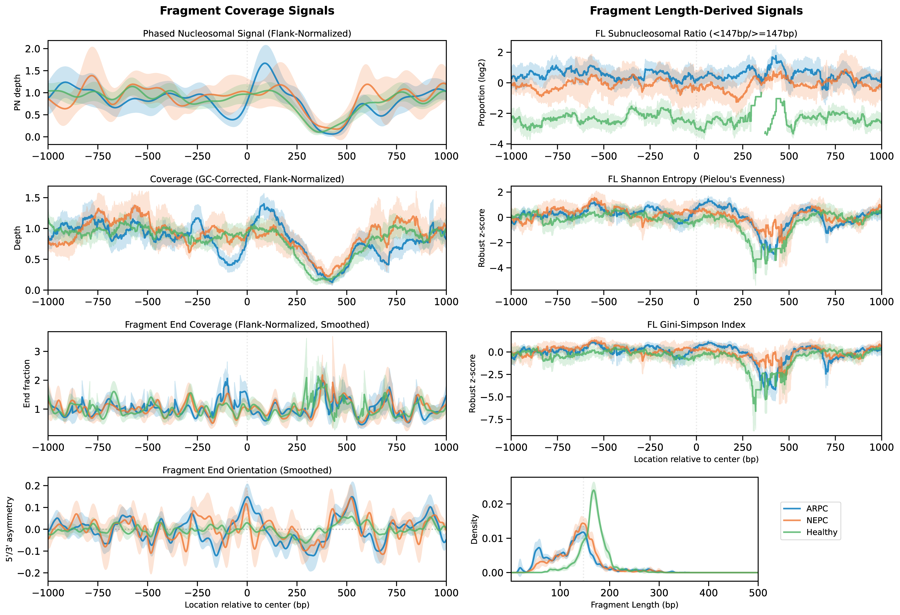
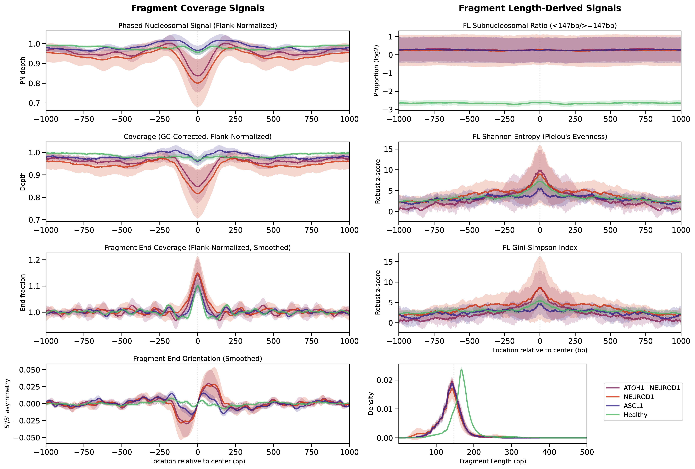

# Triton 

As a cell-free DNA (cfDNA) processing pipeline, Triton conducts fragmentomic and phased-nucleosome coverage analyses on individual or composite genomic regions and outputs both region-level biomarkers and nucleotide-resolution signal profiles.

*Triton* is named for the Greek deity who served as messenger of the deep and would blow a conch shell to calm or raise the waves. Like Triton, this tool has the power to see beyond the waves.

## Table of Contents

* [Description](#description)
* [What's New in v2.0.0](#whats-new-in-v200)
* [Outputs](#outputs)
* [Feature Details and Interpretation](#feature-details-and-interpretation)
* [Publications](#publications)
* [Usage](#usage)
  * [Inputs to Triton.py](#inputs-to-tritonpy)
  * [Contained Scripts](#contained-scripts)
  * [nc_info](#nc_info)
  * [Methodology](#methodology)
  * [To Run as a Snakemake](#to-run-as-a-snakemake)
* [Example Plotting](#example-plotting)
* [Tutorial](#tutorial)
* [Requirements and Installation](#requirements-and-installation)
* [Contact](#contact)
* [Acknowledgments](#acknowledgments)
* [Citing Triton](#citing-triton)
* [License](#license)

## Description

Triton conducts bp-resolution profile analyses for cfDNA samples in BAM or CRAM format, given a list of individual regions of interest (BED file containing, for example, promoter regions or gene bodies) or a list of composite regions of interest sharing a common center (list of BED files each containing, for example, binding locations for a single transcription factor). All fragments in each region/composite region are used to find the fragment size distribution, coverage, and probability of a nucleosome center at each point. GC bias correction files from Griffin† are used for GC correction by default, though alternative methods are supported. Finally, Fast Fourier Transforms are used to isolate well-phased nucleosome-originating signal, from which nucleosome positioning features are drawn.

Outputs may be used either as an endpoint in cfDNA data analysis by outputting ready-to-use features from a given list of regions or composite regions, or as a processing step for further feature extraction from output profiles. Features reported directly from Triton can be used in traditional machine learning approaches, or specific profiles can be plotted with accompanying scripts for qualitative analysis. Signal profiles may also be used in signal-based analyses or in deep learning frameworks (e.g., CNNs).

Triton is part of *The Pantheon* suite of cfDNA processing and analysis tools. While Triton is useful on its own for characterizing the cfDNA-inferred epigenetic landscape in regions of interest, outputs from Triton may also be used by [Proteus](https://github.com/denniepatton/Proteus) in order to predict the underlying tumor expression of individual genes, and by [Keraon](https://github.com/denniepatton/Keraon) in order to predict tumor subtypes and their proportions.


## What's New in v2.0.0

Version 2.0.0 represents a major release with significant improvements to processing and biological interpretability:

### Core Improvements

* **Enhanced GC Correction**: GC bias correction now applies to all fragmentomic analyses, not just coverage, improving accuracy of fragment length distributions and derived metrics
* **Updated Nucleosome Center Weighting**: New empirically-derived weighting matrix (`NCDict.pkl`) better reflects nucleosome dyad positioning across fragment lengths

### Normalization & Weighting

* **Composite Mode Improvements**: Sites are now weighted by sqrt(N_fragments) instead of N_fragments, better balancing reliability vs. over-dominance of high-depth sites
* **Flanking Region Strategy**: Expanded flanking regions (5000 bp default) used exclusively for normalization, excluding the analysis window itself for cleaner signal
* **Window-Normalized Depth**: Now reports both window-normalized depth and central depth metrics (aligned with Griffin methodology)

### Feature & Output Changes

* **Subnucleosomal Threshold**: Fragment length ratio and related metrics now use a biologically-motivated 147 bp threshold (minimum nucleosome wrapping length) instead of 150 bp
* **Fragment Orientation Asymmetry**: New signal track quantifies directional cleavage patterns: (5' ends - 3' ends) / (5' ends + 3' ends)
* **Complete Fragment Distributions**: Outputs site-level GC-corrected fragment length distributions for custom downstream analyses
* **Improved Centering**: Central features now computed at position 0 (window center) rather than detected center, for consistent alignment

### Technical Updates

* **Python 3.13 Support**: Tested and compatible through Python 3.13
* **Strand Handling**: For composite sites without strand information, uses mirrored averaging (both orientations with 1/2 weight each) instead of random assignment
* **Simplified Options**: Background panel generation/subtraction mode removed (was experimental with mixed results)
* **Robust Edge Cases**: Better handling of low-coverage regions and edge cases to prevent NaN propagation

### Performance

* **Memory Optimization**: More efficient array operations and reduced memory overhead for large-scale analyses
* **Vectorized Operations**: Expanded use of NumPy vectorization for faster processing

## Outputs

### Region-Level Features (`_TritonFeatures.tsv`)

Triton region-level features are output as a `.tsv` file and include for each single or composite site:

* **site**: annotation name (composite sites) or `name` from the BED file (individual regions)

#### Fragment Length (FL) Features

*Computed using all fragments within specified length range*

* **fl-mean**: Mean fragment length (bp)
* **fl-stdev**: Standard deviation of fragment lengths (bp)
* **fl-skew**: Skewness of fragment length distribution
* **fl-kurtosis**: Excess kurtosis of fragment length distribution
* **fl-subnucleosomal-ratio**: log₂(fraction < 147 bp / fraction ≥ 147 bp)
* **fl-entropy**: Shannon entropy (Pielou's evenness) of fragment lengths (5-bp binned)
* **fl-gini-simpson**: Gini-Simpson diversity index of fragment lengths (5-bp binned)

#### Phased-Nucleosome (PN) Features

*FFT-based metrics using fragments ≥147 bp*

* **pn-compaction-score**: log₂(amplitude 146–177 bp / amplitude 177–207 bp) — higher indicates compact chromatin
* **pn-mean-spacing**: Mean inter-nucleosomal distance (bp)
* **pn-mean-amplitude**: Mean amplitude of phased nucleosome peaks

#### Profiling Features

*Signal-based metrics computed from bp-resolution tracks*

* **mean-region-depth**: Mean GC-corrected coverage (absolute weighted average in composite mode; raw in region/window mode)
* **central-depth** *: PN signal at window center (mean ±5 bp, normalized by flanking PN signal)
* **central-entropy** *: FL entropy at window center (mean ±5 bp, robust z-score vs. flanking signal)
* **central-gini-simpson** *: FL Gini-Simpson at window center (mean ±5 bp, robust z-score vs. flanking signal)
* **window-depth**: PN signal mean across window (normalized by flanking signal)
* **window-entropy**: FL entropy mean across window (robust z-score vs. flanking signal)
* **window-gini-simpson**: FL Gini-Simpson mean across window (robust z-score vs. flanking signal)

* Window/composite-window mode only; `np.nan` otherwise

### Signal Profiles (`_TritonSignalProfiles.npz`)

Triton outputs bp-resolution "signal profiles" as NumPy compressed files (`.npz`), one per sample, containing one array per queried site. For example, 100 composite sites with 2000 bp windows produce 100 arrays of shape `2000×8` (composite) or `2000×12` (window/region). Profiles are not output for regions >5 kb to conserve memory.

**Signal tracks (all modes):**

1. **Depth**: GC-corrected coverage, normalized by flanking mean
2. **Fragment End Coverage**: Fragment end density (5' + 3' ends) / total fragments
3. **Fragment End Orientation Asymmetry**: (5' ends - 3' ends) / (5' + 3' ends) — directional cleavage signature
4. **PN profile**: Phased-nucleosome signal (FFT low-pass filtered, normalized by flanking mean)
5. **FL subnucleosomal ratio**: log₂(< 147 bp / ≥ 147 bp) at each position
6. **FL entropy**: Shannon entropy (robust z-score vs. flanking median and MAD)
7. **FL Gini-Simpson**: Diversity index (robust z-score vs. flanking median and MAD)
8. **PN peak locations**: Local maxima/minima (1: peak, -1: trough)

**Additional tracks (window/region mode only):**

9. **A**: Adenine (one-hot encoded, based on reference sequence)
10. **C**: Cytosine (one-hot encoded, based on reference sequence)
11. **G**: Guanine (one-hot encoded, based on reference sequence)
12. **T**: Thymine (one-hot encoded, based on reference sequence)

### Additional Outputs

* **Fragment Length Distributions** (`_TritonFragmentationProfiles.npz`): Complete GC-corrected fragment length probability distributions for each site
* **Skipped Sites** (`_SkippedSites.bed`): Individual site coordinates excluded due to insufficient coverage (< 80% bases covered) or outlier metrics (MAD > 10), with rejection reason and site ID columns

## Feature Details and Interpretation

### Region-Level Features

The following table details each region-level feature with biological context:

| Feature                     | Description                                                               | Biological Interpretation                                                                                                                                                                                                                                                          |
| --------------------------- | ------------------------------------------------------------------------- | ---------------------------------------------------------------------------------------------------------------------------------------------------------------------------------------------------------------------------------------------------------------------------------- |
| **fl-mean**                 | Mean fragment length (bp).                                                | Typically ~167 bp in healthy cfDNA (nucleosome + linker). Shorter means increased cleavage within non-nucleosomal regions (e.g., TF-bound or open chromatin). In cancer or highly active chromatin, necrotic degradation and transcriptional activity both bias fragments shorter. |
| **fl-stdev**                | Standard deviation of fragment lengths.                                   | Reflects consistency of nucleosome wrapping. Low in well-phased, inactive regions (tight nucleosomal protection), high in transcriptionally active or disrupted chromatin.                                                                                                         |
| **fl-skew**                 | Skewness of fragment length distribution.                                 | Negative skew indicates a heavier short-fragment tail (increased open/active chromatin); positive skew indicates excess long fragments (compact chromatin or high nucleosome stability).                                                                                           |
| **fl-kurtosis**             | Excess kurtosis of fragment length distribution.                          | High (leptokurtic) = strong tails with outliers (heterogeneous fragmentation, cancer); low (platykurtic) = uniform, well-phased nucleosomal fragments (healthy).                                                                                                                   |
| **fl-subnucleosomal-ratio** | log₂ (frac < 147 bp / frac ≥ 147 bp).                                     | Enrichment of sub-nucleosomal (<147 bp) fragments marks open chromatin and non-nucleosomal protection (TF binding, nuclease hypersensitivity).                                                                                                                                     |
| **fl-entropy**              | Shannon entropy (Pielou-normalized) of fragment-length distribution.      | Quantifies uncertainty/diversity in observed fragment lengths. Higher entropy = greater heterogeneity and open chromatin; lower entropy = regular nucleosomal spacing.                                                                                                             |
| **fl-gini-simpson**         | 1 − ∑ pᵢ² diversity index of fragment lengths.                            | Robust at low depth; similar interpretation to entropy. High values = diverse fragment lengths → open chromatin or TF activity.                                                                                                                                                    |
| **pn-compaction-score**     | log₂ (amplitude 146–177 bp / amplitude 177–207 bp) from FFT on PN signal. | High = compact, inactive chromatin with strong 10.5 bp periodicity. Low = open or disorganized nucleosome arrays typical of active or cancer regions.                                                                                                                              |
| **pn-mean-spacing**         | Average inter-nucleosomal distance (bp) from PN signal.                   | Longer spacing → more open chromatin; shorter spacing → denser nucleosome packing.                                                                                                                                                                                                 |
| **pn-mean-amplitude**       | Mean amplitude of periodic PN peaks.                                      | High amplitude = well-phased nucleosomes (stable/quiet); low amplitude = dynamic or disrupted nucleosomes (active).                                                                                                                                                                |
| **mean-region-depth**       | GC-corrected mean coverage.                                               | Indicates read support. In composite mode, reflects average per-site depth across all contributing windows.                                                                                                                                                                        |
| **central-depth** *         | PN signal mean ± 5 bp around the center.                                  | Low or negative = nucleosome vacancy or accessible region.                                                                                                                                                                                                                         |
| **central-entropy** *       | FL entropy mean ± 5 bp around the center.                                 | High = increased heterogeneity, suggesting TF or remodeler binding.                                                                                                                                                                                                                |
| **central-gini-simpson** *  | FL diversity mean ± 5 bp around the center.                               | Same as entropy: elevated in accessible, dynamic regions.                                                                                                                                                                                                                          |
| **window-depth**            | PN signal mean across full window.                                        | Low or negative = nucleosome depletion.                                                                                                                                                                                                                                            |
| **window-entropy**          | FL entropy mean across window.                                            | High = heterogeneous or active region.                                                                                                                                                                                                                                             |
| **window-gini-simpson**     | FL diversity mean across window.                                          | High = variable fragment lengths → open chromatin.                                                                                                                                                                                                                                 |

* Window/composite-window mode only

### Signal Profiles

The following table details each bp-resolution signal track:

| Signal                                        | Description                                                                                   | Biological Interpretation                                                                                    |
| --------------------------------------------- | --------------------------------------------------------------------------------------------- | ------------------------------------------------------------------------------------------------------------ |
| **depth**                                     | GC-corrected coverage normalized to flanks.                                                   | Relative local coverage; correlates with fragment abundance.                                                 |
| **EPC (fragment end coverage)**               | End-position counts of cfDNA fragments.                                                       | Peaks mark nuclease-accessible linker regions; dips indicate nucleosome cores.                               |
| **ASYM (fragment end orientation asymmetry)** | Difference between 5′ and 3′ fragment-end coverage (oriented).                                | Sign changes (peak→dip) define nucleosome footprints; large magnitude = strong directional cleavage pattern. |
| **PN profile**                                | Coverage re-weighted by per-fragment nucleosome-dyad probability and low-pass filtered (FFT). | Highlights constitutive nucleosome phasing and chromatin compaction.                                         |
| **FL subnucleosomal ratio**                   | log₂ (x < 147 / x ≥ 147) at each bp.                                                          | Local enrichment of sub-nucleosomal fragments → open chromatin, TF binding.                                  |
| **FL Shannon entropy / Pielou evenness**      | Robust z-score vs median ± MAD of flanking signal.                                            | Elevated = heterogeneous fragment lengths (dynamic chromatin).                                               |
| **FL Gini-Simpson index**                     | Robust z-score vs flanks.                                                                     | Same interpretation as entropy; robust at lower read depth.                                                  |
| **PN peak locations**                         | Detected PN local maxima.                                                                     | Mark well-phased nucleosomes and enable spacing/compaction quantification.                                   |

### Complementary Metric Categories

Triton's features capture distinct aspects of chromatin biology:

| Category                                      | Representative Metrics                                  | Distinct Insight                                                                                                           |
| --------------------------------------------- | ------------------------------------------------------- | -------------------------------------------------------------------------------------------------------------------------- |
| **Absolute fragment length**                  | fl-mean, fl-subnucleosomal-ratio                        | Indicates typical protection length and cleavage origin.                                                                   |
| **Heterogeneity / variability**               | fl-stdev, fl-entropy, fl-gini-simpson, fl-kurtosis      | Capture spread and diversity, which distinguish *mixed* chromatin states even if means are equal.                          |
| **Shape / asymmetry**                         | fl-skew, fl-kurtosis                                    | Reveal bias toward short or long tails—detect asymmetric cleavage activity.                                                |
| **Chromatin phasing / compaction**            | pn-compaction-score, pn-mean-spacing, pn-mean-amplitude | Operate in frequency domain, independent of fragment length histogram; reflect higher-order nucleosome array organization. |
| **Occupancy / accessibility (local signals)** | depth, EPC, ASYM, PN profile                            | Resolve spatial context (linker vs nucleosome center) unavailable to region-level stats.                                   |

### Cohort-Level Analyses

**Important Note**: When performing comparisons across samples or patients within a cohort, it is strongly recommended to apply **site-level z-scoring** to normalize for technical variation and batch effects. This standardization ensures that biological differences, rather than sequencing depth or sample-specific biases, drive downstream analyses and model predictions.

## Publications

[Nucleosome Patterns in Circulating Tumor DNA Reveal Transcriptional Regulation of Advanced Prostate Cancer Phenotypes](https://doi.org/10.1158/2159-8290.CD-22-0692)

If you use Triton in your work, please cite the paper above (see [Citing Triton](#citing-triton)).

## Usage

### Inputs to Triton.py:

```
-n, --sample_name               : sample identifier (string, required)
-i, --input                     : input .bam file (path, required)
-b, --bias                      : input-matched .GC_bias file (path, e.g., from Griffin†, required)
-a, --annotation                : regions of interest as a BED file OR text file containing a list of BED file paths (required)
-g, --reference_genome          : reference genome .fa file (path, required)
-r, --results_dir               : directory for output (path, required)
-m, --run_mode                  : run mode ("region", "window", or "composite-window"; string, required)
-q, --map_quality               : minimum read mapping quality to keep (int, default=20)
-f, --size_range                : fragment size range in bp to keep (int tuple, default=(15, 500))
-c, --cpus                      : number of CPUs to use for parallel processing of regions (int, optional)
-d, --frag_dict                 : dictionary of probable nucleosome center locations (.pkl file). Defaults to nc_info/NCDict.pkl
```

#### (extra details)

**input**
Input `.bam` (or `.cram`) files must be pre-indexed with matching `.bam.bai` (`.cram.crai`) files in the same directory.

**bias**
Sample-matched `.GC_bias` files can be generated using Griffin's GC correction method ([https://github.com/GavinHaLab/Griffin](https://github.com/GavinHaLab/Griffin)) or another tool producing the same format:

```
length   num_GC   smoothed_GC_bias
...
```

with all combinations of fragment length / GC content for a given sample and an associated bias.

**annotation**

* In "region" mode, provide a single [BED-like file](https://www.genome.ucsc.edu/FAQ/FAQformat.html#format1) with columns `[chrom, chromStart, chromEnd, name/Gene]`.
* In "window" mode, a `[position]` column is required to define the window's center.
* In "composite-window" mode, supply a **text file** containing paths to multiple BED-like files (each with a `[position]` column).

Example canonical annotation files are provided in `config/site_lists`:

* `MANE.GRCh38.v1.3_TranscriptBodies.bed` for region mode (full gene bodies)
* `MANE.GRCh38.v1.3_TSS.bed` for window mode (promoter regions)
* `GTRD_F1000.tsv` or `GTRD_F10000.tsv` for composite-window mode (pointing to directories of BEDs for TFBSs), which contain 1,000 and 10,000 sites, respectively, for each TFBS.

**reference_genome**
The `.fa` file must match the build used to align your samples.

**run_mode**

* "region" mode: analyze the entire region (`chromStart:chromStop`)
* "window" mode: analyze ±1000 bp (default; 2000 bp total) from the `position` index
* "composite-window" mode: aggregate reads from all sites in each passed file, aligning based on the  `position` index

### Contained Scripts

* **Triton/Triton.py** – primary script containing the `generate_profile()` function
* **Triton/triton_helpers.py** – helper functions called by Triton.py
* **Triton/triton_cleanup.py** – combines `TritonFeatures.tsv` output from multiple samples
* **Triton/triton_plotters.py** – plotting utilities for `.npz` outputs
* **Triton/triton_extractors.py** – extraction utilities for pulling additional, custom features from signal profiles
* **Triton/nc_dist.py** – a modified script for generating composite nucleosome-center profiles (see [nc_info](#nc_info))
* **Triton/nc_analyze.py** – used after nc_dist.py to create the frag_dict and plot results (see [nc_info](#nc_info))

#### triton_plotters.py

`triton_plotters.py` plots Triton `.npz` output profiles into multi-panel PDF figures (one PDF per site).

Current CLI inputs (see `Triton/triton_plotters.py`):

* `--input / -i`: one or more directories containing Triton output files. The directory name is treated as the sample name.

  * Expected files inside each directory: `{sample}_TritonSignalProfiles.npz` (required) and `{sample}_TritonFragmentationProfiles.npz` (optional).
* `--categories / -c` (optional): two-column TSV mapping `sample` → `category` (no header). When provided, samples are plotted as category means with a 95% CI.
* `--palette / -p` (optional): two-column TSV mapping `sample` or `category` → hex color (no header).
* `--sites / -s` (optional): file containing a list of site names to plot (no header); defaults to plotting all sites present.
* `--region_axis / -r` (optional): set the x-axis origin to the left edge (region-style) instead of the window center.

Run `python Triton/triton_plotters.py -h` for details.

#### triton_extractors.py

`triton_extractors.py` is a simple example script to help extract or transform the `.npz` signal outputs from Triton. Users are encouraged to modify it as needed for custom analyses.

### nc_info

Instead of ignoring fragment length when producing nucleosome coverage signals, Triton empirically re-weights coverage according to each fragment's most probable nucleosome center. This is derived from iNPS peak data across multiple human tissues/cell lines and healthy-donor cfDNA. The resulting matrix, stored as `nc_info/NCDict.pkl`, captures how fragment length maps to nucleosome center placement.

If you wish to regenerate `NCDict.pkl` with your own site lists or samples, see `nc_dist.py` and `nc_analyze.py` in `nc_info/`.


### Methodology

1. Triton retrieves reads overlapping each region (`pysam` for random `.bam` access)
2. Reads are discarded if not paired, not uniquely mapped, flagged as duplicate, or if their complete fragment lengths fall outside of the specified fragment length range (default 15–500 bp)
3. For coverage arrays, only fragments ≥147 bp are used (minimum nucleosome wrapping length)
4. Fragment-level GC correction is applied to all fragments for both coverage and fragmentomics analyses
5. Nucleosome center re-weighting is applied based on fragment length using empirical probability matrix
6. Composite-window uses stable flank normalization (ratio-of-sums), while window/region modes apply post-aggregation flank normalization
7. Fourier transform filtering isolates the fundamental nucleosome phasing signal (periods ≥147 bp)
8. Local peak calling yields phasing features such as nucleosome spacing and amplitude
9. Fragment length distributions (region-level and per-bp) are used to generate the remaining fragmentomic features

#### Composite Mode Normalization Details

In composite-window mode, signals undergo the following normalization:

1. **Stable flank normalization (depth + nc_signal)**: Composite depth and nc_signal are flank-normalized using a ratio-of-sums estimator. For sites \(i\) with weight \(w_i\), bp-resolution signal \(s_i(x)\), and scalar flank mean \(\mu_i\), the composite is:

   $$
   S(x) = \frac{\sum_i w_i\,s_i(x)}{\sum_i w_i\,\mu_i}.
   $$

   This is computed separately for depth and nc_signal, and is robust to noisy per-site flank means at low depth.

2. **Fragment-based probability normalization**: Fragment length distributions and fragment length profiles are converted to probability distributions (normalized by totals) so contribution is proportional to fragmentation patterns rather than absolute fragment counts.

3. **Weighting**: Each site receives weight \(w = \sqrt{n_{\mathrm{frag}}}\) to balance reliability vs. over-dominance.

4. **Weighted aggregation**: Probability-distribution tracks are multiplied by \(w\) and summed across sites.

5. **Final normalization**: Probability-distribution tracks are divided by total cumulative weight \(W = \sum_i w_i\). No additional post-aggregation flank normalization is applied for depth/nc_signal since they are already normalized by the ratio-of-sums estimator above.


This ensures sites contribute based on fragmentation patterns rather than raw counts, with weighting proportional to \(\sqrt{n_{\mathrm{frag}}}) to prevent high-depth sites from dominating the composite signal.

### To Run as a Snakemake

1. Update the following files to match your system:

   * `config/config.yaml` – specify inputs (annotation, cluster script path, etc.)
   * `config/cluster_slurm.yaml` – cluster resource configs
   * `config/samples.yaml` – sample info; see `example_samples.yaml`
2. If on a Fred Hutch server, load the Python modules indicated in the header of `Triton.snakefile`
   Otherwise, set up a local environment following [Requirements and Installation](#requirements-and-installation)
3. Run the following snakemake command:

   ```
   snakemake -s Triton.snakefile --latency-wait 60 --keep-going \
   --cluster-config config/cluster_slurm.yaml \
   --cluster "sbatch -p {cluster.partition} --mem={cluster.mem} -t {cluster.time} -c {cluster.ncpus} -n {cluster.ntasks} -o {cluster.output} -J {cluster.JobName}" \
   -j 40 -np
   ```

   Removing `-np` to actually initiate jobs following validation.

## Example Plotting

Below are examples of output profiles, plotted using triton_plotters.py, illustrating typical outputs.

1. The following figure shows the TSS (promoter) profile for the gene AR across a cohort including ARPC PDX ctDNA, NEPC PDX ctDNA, and Healthy Donor cfDNA. Sequencing depth varies from 5–50× across samples, and subtypes are plotted as the mean and 95% CI across samples in each group. Note that AR is active in AR-driven prostate cancer (ARPC) but not in neuroendocrine-like prostate cancer (NEPC) or in the immune background observed in healthy cfDNA. In both Phased Nucleosomal Signal and Coverage, we observe a dip in ARPC coverage immediately before 0 (the putative TSS), along with a spike at around 125 bp where the +1 nucleosome is expected—indicative of active transcription. A slight increase of fragment ends around the TSS in ARPC samples indicates potential TF (small-footprint) binding. In the Fragment End Orientation signal, a peak → trough diagonal line intersecting 0 indicates regular nucleosome positioning with that approximate footprint, which is observed for the +1 nucleosome for ARPC; a trough → peak diagonal intersecting 0 likewise indicates a nucleosome-depleted region, observed in the same place as the coverage dip. Fragment-length-derived signals are often noisy in single region/window (non-composite) mode at these depths. However, note that ARPC has the highest average subnucleosomal ratio (higher likelihood of TF binding), which is echoed in the Fragment Length Density plot showing a peak of small fragments < 100 bp seen in ARPC but not NEPC. ARPC and NEPC lines are similar throughout, as ctDNA has a shorter canonical length than cfDNA. Dropout is observed on the right side of both diversity signals, reflecting near-zero coverage in that area.



2. The next figure again looks at healthy donor cfDNA and PDX ctDNA, here from small cell lung cancer (SCLC) models with ATOH1+NEUROD1, NEUROD1, or ASCL1 positive molecular subtypes with depth from 5-50x. Whereas the previous figure showed a single TSS, this is using a composite-window TFBS run where the 1,000 sites per TF, in this case NEUROD1, are used. All plots have left-right (or rotational in the case of Fragment End Orientation) symmetry reflecting unknown TF-binding orientation at each site. A clear central dip in NEUROD1+ groups in both Phased Nucleosomal Signal and Coverage indicate NEUROD1 activity/binding, as does an increase in small fragment footprints around 0. The clear dip -> trough diagonal intersect at 0 across all groups in the Fragment End Orientation signal indicates nucleosome depletion; this is most prominent for the NEUROD1+ lines, where the greater separation also implies a wider depletion area. In general, the peak/trough edges in the Fragment End Orientation signals roughly correspond to the boundaries between nucleosome occupied vs unoccupied regions. In the Fragment Length-Derived Signals we again see ctDNA groups showing a shorter overall fragment length distribution compared to healthy cfDNA, however with greater relative depth achieved through compositing sites we also see a clear peak in fragment length diversity around 0 in both NEUROD1+ groups.



## Tutorial

### Tutorial for Fred Hutch Servers

Below is an example workflow if you are on Fred Hutch infrastructure. Load necessary modules and then run the Triton snakefile:

```bash
# Clone Triton
git clone https://github.com/denniepatton/Triton.git
cd Triton

# Example module loads on FH systems
ml snakemake/5.19.2-foss-2019b-Python-3.7.4
ml Python/3.7.4-foss-2019b-fh1

# Run Snakemake with HPC specifics
snakemake -s Triton.snakefile --latency-wait 60 --keep-going \
--cluster-config config/cluster_slurm.yaml \
--cluster "sbatch -p {cluster.partition} --mem={cluster.mem} -t {cluster.time} -c {cluster.ncpus}" \
-j 40
```

If you prefer a more direct approach without Snakemake, simply call `Triton.py`:

```bash
python3 Triton/Triton.py \
  --sample_name SAMPLE_ID \
  --input /path/to/sample.bam \
  --bias /path/to/sample.GC_bias \
  --annotation config/site_lists/MANE.GRCh38.v1.3_TSS.bed \
  --reference_genome /path/to/genome.fa \
  --results_dir results/ \
  --run_mode window
```

### Tutorial for non–Fred Hutch users (Local or Other HPC)

1. **Install micromamba** (if you don't already have it):
   See instructions at [https://mamba.readthedocs.io](https://mamba.readthedocs.io).
2. **Clone the Triton repository**:

   ```bash
   git clone https://github.com/denniepatton/Triton.git
   cd Triton
   ```
3. **Create the environment**:

   ```bash
   micromamba create -n Triton -f environment.yml -c conda-forge -c bioconda
   micromamba activate Triton
   ```
4. **Local/Single-machine usage**:
   You can run `Triton.py` directly from the command line:

   ```bash
   python3 Triton/Triton.py \
     --sample_name SAMPLE_ID \
     --input /path/to/sample.bam \
     --bias /path/to/sample.GC_bias \
     --annotation my_sites.bed \
     --reference_genome /path/to/genome.fa \
     --results_dir ./my_results \
     --run_mode region
   ```
5. **HPC usage (non–Fred Hutch)**:

   * Configure your job submission scripts or cluster environment (e.g., SLURM, PBS).
   * Adjust Snakemake's cluster directives in the same manner as for Fred Hutch (see above example).
   * Submit jobs with your cluster's submission command, referencing your own cluster configuration.

## Requirements and Installation

Triton requires standard Python libraries (e.g. NumPy, SciPy, pysam) and is compatible with Python 3.7+ (tested up to Python 3.13).

### Micromamba/Conda Environment

* We recommend building a virtual environment using the provided `environment.yml` with micromamba
* Users can then recreate the environment exactly via:

  ```bash
  micromamba create -n Triton -f environment.yml -c conda-forge -c bioconda
  micromamba activate Triton
  ```
* This approach **does not** require an Anaconda license; micromamba is a lightweight, open-source package manager compatible with conda-forge/bioconda.

## Contact

If you have any questions or feedback which cannot be addressed on GitHub, please contact me at [rpatton@fredhutch.org](mailto:rpatton@fredhutch.org)

## Acknowledgments

Triton is developed and maintained by Robert D. Patton in the Gavin Ha Lab, Fred Hutchinson Cancer Center.
Anna-Lisa Doebley provided input and developed the GC-correction process used in Triton, originally found
in the [Griffin](https://github.com/GavinHaLab/Griffin) pipeline.

† **Griffin-based GC correction**
Triton takes BAM-matched GC bias data produced by the Griffin workflow; the workflow with instructions for generating bias files can be
found at [https://github.com/GavinHaLab/Griffin](https://github.com/GavinHaLab/Griffin).

## Citing Triton

If you use Triton in your research, please cite:

De Sarkar N, Patton RD, Doebley A-L, et al. *Nucleosome Patterns in Circulating Tumor DNA Reveal Transcriptional Regulation of Advanced Prostate Cancer Phenotypes.* **Cancer Discovery**. 2022;13(3):632–653. [https://doi.org/10.1158/2159-8290.CD-22-0692](https://doi.org/10.1158/2159-8290.CD-22-0692)

BibTeX:

```bibtex
@article{De_Sarkar_2022,
   title   = {Nucleosome Patterns in Circulating Tumor DNA Reveal Transcriptional Regulation of Advanced Prostate Cancer Phenotypes},
   author  = {De Sarkar, Navonil and Patton, Robert D. and Doebley, Anna-Lisa and Hanratty, Brian and Adil, Mohamed and Kreitzman, Adam J. and Sarthy, Jay F. and Ko, Minjeong and Brahma, Sandipan and Meers, Michael P. and Janssens, Derek H. and Ang, Lisa S. and Coleman, Ilsa M. and Bose, Arnab and Dumpit, Ruth F. and Lucas, Jared M. and Nunez, Talina A. and Nguyen, Holly M. and McClure, Heather M. and Pritchard, Colin C. and Schweizer, Michael T. and Morrissey, Colm and Choudhury, Atish D. and Baca, Sylvan C. and Berchuck, Jacob E. and Freedman, Matthew L. and Ahmad, Kami and Haffner, Michael C. and Montgomery, R. Bruce and Corey, Eva and Henikoff, Steven and Nelson, Peter S. and Ha, Gavin},
   journal = {Cancer Discovery},
   volume  = {13},
   number  = {3},
   pages   = {632--653},
   year    = {2022},
   month   = nov,
   doi     = {10.1158/2159-8290.CD-22-0692},
   url     = {https://doi.org/10.1158/2159-8290.CD-22-0692},
   issn    = {2159-8290},
   publisher = {American Association for Cancer Research (AACR)}
}
```

## License

The MIT License (MIT)

Copyright (c) 2026 Fred Hutchinson Cancer Center

Permission is hereby granted, free of charge, to any government or not-for-profit entity, or to any person employed at one of the foregoing (each, an "Academic Licensee") who obtains a copy of this software and associated documentation files (the "Software"), to deal in the Software purely for non-commercial research and educational purposes, including the rights to use, copy, modify, merge, publish, distribute, sublicense, and/or share copies of the Software, and to permit other Academic Licensees to whom the Software is furnished to do so, subject to the following conditions:

The above copyright notice and this permission notice shall be included in all copies or substantial portions of the Software.

No Academic Licensee shall be permitted to sell or use the Software or derivatives thereof in any service for commercial benefit. For the avoidance of doubt, any use by or transfer to a commercial entity shall be considered a commercial use and will require a separate license with Fred Hutchinson Cancer Center.

THE SOFTWARE IS PROVIDED "AS IS", WITHOUT WARRANTY OF ANY KIND, EXPRESS OR IMPLIED, INCLUDING BUT NOT LIMITED TO THE WARRANTIES OF MERCHANTABILITY, FITNESS FOR A PARTICULAR PURPOSE AND NONINFRINGEMENT. IN NO EVENT SHALL THE AUTHORS OR COPYRIGHT HOLDERS BE LIABLE FOR ANY CLAIM, DAMAGES OR OTHER LIABILITY, WHETHER IN AN ACTION OF CONTRACT, TORT OR OTHERWISE, ARISING FROM, OUT OF OR IN CONNECTION WITH THE SOFTWARE OR THE USE OR OTHER DEALINGS IN THE SOFTWARE.
