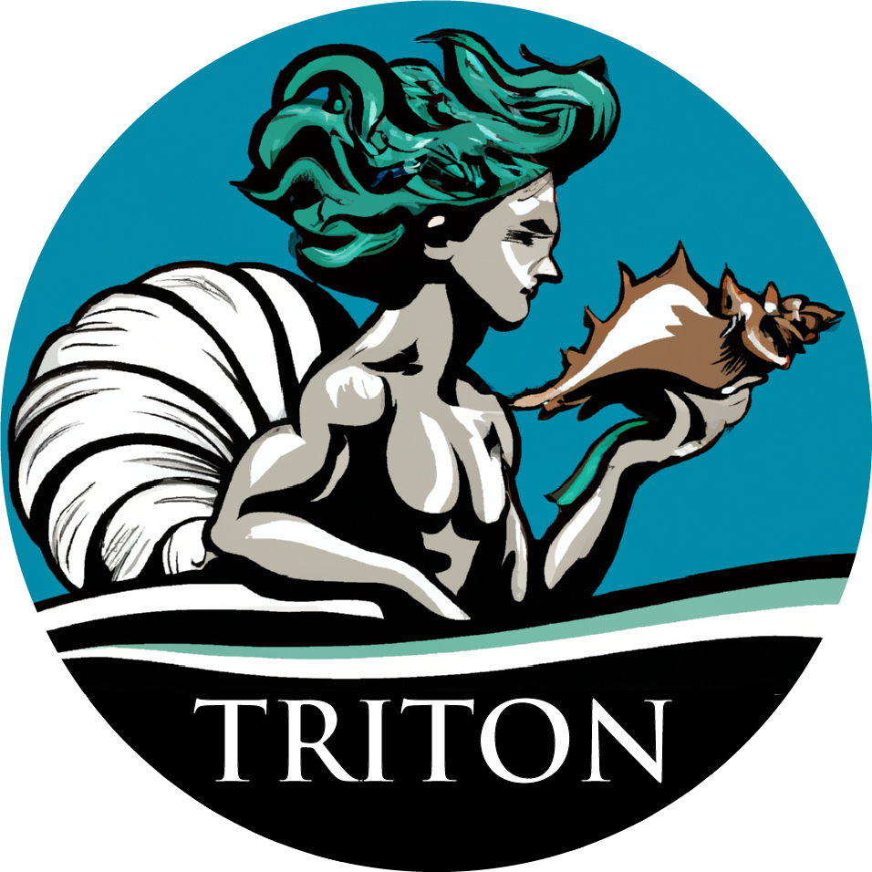

# Triton 
a cell free DNA (cfDNA) processing pipeline, Triton conducts fragmentomic. 
and nucleosome-phasing analyses on individual or composite genomic regions

## Description
Triton conducts nucleotide-resolution profile analysis for cfDNA samples in BAM format, given a list of individual regions of interest (BED containing,
for example, promoter regions or gene bodies) or list of composite regions of interest sharing a common center (list of BED files each containing, for
example, binding locations for a single transcription factor). All fragments in each region/composite region are used to find the fragment size
distribution, coverage, and probabability of a nucleosome center at each point. Fast Fourier Transforms are then used to isolate well-phased
nucleosome derived signal, from which specific features are drawn.

### Outputs

Triton profiles are output as a NumPy compressed file (.npz), one for each sample, containing one object for each queried (composite) site.
Nucleotide-resolution profiles include:

  1: Depth (GC-corrected, if provided). 
  2: Nucleosome-level phased profile. 
  3: Nucleosome center profile (GC-corrected, if provided). 
  4: Mean fragment size. 
  5: Fragment size Shannon entropy. 
  6: Region fragment profile Dirichlet-normalized Shannon entropy. 
  7: Fragment heterogeneity (unique fragment lengths / total fragments). 
  8: Fragment MAD (Mean Absolute Deviation). 
  9: Short:long ratio (x <= 120 / 140 <= x <= 250). 
  10: A (Adenine) frequency**. 
  11: C (Cytosine) frequency**. 
  12: G (Guanine) frequency**. 
  13: T (Tyrosine) frequency**. 
  
Triton region-level features are output as a .tsv file and include:

  site: annotation name if stacked, "name" from BED file for each region otherwise
      ### Region-level features (fragmentation) ###
  fragment-mean: fragment lengths' mean
  fragment-stdev: fragment lengths' standard deviation
  fragment-mad: fragment lengths' MAD (Mean Absolute Deviation)
  fragment-ratio: fragment lengths' short:long ratio (x <= 120 / 140 <= x <= 250)
  fragment-entropy: fragment lengths' Shannon entropy
      ### Region-level features (phasing) ###
  np-score: Nucleosome Phasing score
  np-period: phased-nucleosome periodicity
      ### Region-level features (profile-based) ###
  mean-depth: mean depth in the region (GC-corrected, if provided)
  var-ratio: ratio of variation to constant noise in the phased signal
  central-depth*: central inflection value as a fraction of the total variation (+ = peak, - = trough)
  plus-minus-ratio*: ratio of height of +1 nucleosome to -1 nucleosome, relative to variation minimum
  central-loc*: location of central inflection relative to window center (0)
  plus-one-pos*: location relative to central-loc of plus-one nucleosome
  minus-one-pos*: location relative to central-loc of minus-one nucleosome
  
* these features are output as np.nan if window == None
** sequence is based on the reference, not the reads

### Examples

### Uses

Triton may be used either as an end point in cfDNA data analysis by outputting ready-to-use features from a given list of regions or
composite regions, or as processing step for further feature extraction from output profiles. Biomarkers reported directly from
Triton can be used to distinguish cancer lineages (see Publications) in tradtional machine learning approaches, specific profiles
may be plotted for qualitative analysis, or profile outputs may be utilized in signal-based analyses and learning structures, 
e.g. Convolutional Neural Networks (CNNs). 

### Publications

<https://doi.org/10.1158/2159-8290.CD-22-0692>

## Usage

## Requirements

See Triton/pythonversion.txt and Triton/requiremenets.txt for an up-to-date list of all package versions

## Contact
If you have any questions or feedback, please contact me at:  
**Email:** <rpatton@fredhutch.org>

## Acknowledgements
Triton is developed and maintained by Robert D. Patton in the Gavin Ha Lab, Fred Hutchinson Cancer Center
Anna-Lisa Doebley provided critical input and developed the GC-correction process used in Triotn, originally found
in the Griffin (<https://github.com/GavinHaLab/Griffin>) pipeline.

## Software License
Triton
Copyright (C) 2022 Fred Hutchinson Cancer Center

You should have received a copy of The Clear BSD License along with this program.
If not, see <https://spdx.org/licenses/BSD-3-Clause-Clear.html>.
