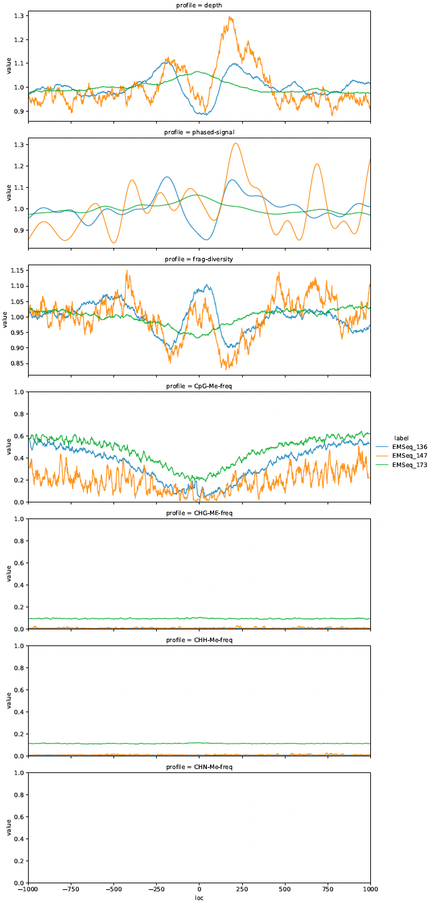

# Triton 
A cell free DNA (cfDNA) processing pipeline, Triton conducts fragmentomic and phased-nucleosome coverage analyses on individual or
composite genomic regions and outputs both region-level biomarkers and nt-resolution signal profiles.
<br/><br/>


## Description
Triton conducts nucleotide-resolution profile analyses for cfDNA samples in BAM format, given a list of individual regions of interest (BED containing,
for example, promoter regions or gene bodies) or list of composite regions of interest sharing a common center (list of BED files each containing, for
example, binding locations for a single transcription factor). All fragments in each region/composite region are used to find the fragment size
distribution, coverage, and probability of a nucleosome center at each point. GC bias correction files from Griffin† may also be incorporated
for GC correction. Fast Fourier Transforms are then used to isolate well-phased nucleosome derived signal, from which specific features are drawn.
Triton also accepts Bismark methylation caller output alignment files (see TritonMe) in which case nt-resolution and region-level methylation signals
are also output.

### Outputs

Triton signal profiles are output as NumPy compressed files (.npz), one for each sample, containing one NumPy array object for each queried
(individual or composite) site. E.g. if 100 composite site lists are passed with a window size of 2000bp, each output file will contain
100 named arrays, each with shape 2000x11.

Nucleotide-resolution profiles include:

    1: Coverage/Depth (GC-corrected, if provided)  
    2: Probable nucleosome center profile (fragment length re-weighted depth)  
    3: Phased-nucleosome profile (Fourier-filtered probable nucleosome center profile)  
    4: Fragment lengths' short:long ratio (x <= 150 / x > 150)  
    5: Fragment lengths' diversity (unique fragment lengths / total fragments, i.e. multiset support / cardinality)  
    6: Fragment lengths' Shannon Entropy (normalized to window Shannon Entropy)  
    7: Peak locations (-1: trough, 1: peak, -2: minus-one peak, 2: plus-one peak, 3: inflection point)***  
    8: A (Adenine) frequency**  
    9: C (Cytosine) frequency**  
    10: G (Guanine) frequency**  
    11: T (Tyrosine) frequency**  
  
Triton region-level features are output as a .tsv file and include:

    site: annotation name if using composite sites, "name" from BED file for each region otherwise  
        ### Fragmentation Features (using all fragments in passed range/bounds) ###  
    fragment-mean: fragment lengths' mean  
    fragment-stdev: fragment lengths' standard deviation  
    fragment-median: fragment lengths' median  
    fragment-mad: fragment lengths' MAD (Median Absolute Deviation)  
    fragment-ratio: fragment lengths' short:long ratio (x <= 150 / x > 150)  
    fragment-diversity: fragment lengths' diversity (unique fragment lengths / total fragments, i.e. multiset support / cardinality)  
    fragment-entropy: fragment lengths' Shannon entropy  
        ### Phasing Features (FFT-based, using >= 146bp fragments and local peak calling) ###  
    np-score: Nucleosome Phasing Score (NPS)  
    np-period: phased-nucleosome period / mean inter-nucleosomal distance  
    np-amplitude: phased-nucleosome mean amplitude  
        ### Profiling Features (Filtered signal-based, using >= 146bp fragments and local peak calling) ###  
    mean-depth: mean depth in the region (GC-corrected, if provided)  
    var-ratio: ratio of variation in total phased signal (max signal range : max signal height)  
    plus-one-pos*: location relative to central-loc of plus-one nucleosome  
    minus-one-pos*: location relative to central-loc of minus-one nucleosome  
    plus-minus-ratio*: ratio of height of +1 nucleosome to -1 nucleosome  
    central-loc*: location of central inflection relative to window center (0)  
    central-depth*: phased signal value at the central-loc (with mean in region set to 1)  
    central-diversity*: mean fragment diversity value in the +/-5 bp region about the central-loc (with mean in region set to 1)  

 N.B. that np-amplitude, var-ratio, and fragment diversity measures (fragment-diversity, fragment-ent, and central-diversity) are sensitive to
 sequencing depth and will be increasingly inversely correlated with sample coverage at low depths.

 When run in composite mode Triton will also output a SkippedSites.bed for each samples, containing individual site
 coordinates for sites skipped due to insufficient or outlier coverage (MAD > 10 in any region). This file will share the format
 of whatever input is provided with additional "reject_reason" and "site_ID" columns. These sites may then be run in individual mode
 (in which case modifications in the "name" column may be required if identical between sites) to examine reason for removal.
  
\* these features are only output if a window is set, otherwise np.nan is reported  
\** sequence is based on the reference, not the reads (nt frequency, in composite mode)  
\*** minus-one, plus-one, and inflection locs are only called if a window is set, and supersede peak/trough  

### Uses

Triton may be used either as an endpoint in cfDNA data analysis by outputting ready-to-use features from a given list of regions or
composite regions, or as a processing step for further feature extraction from output profiles. Biomarkers reported directly from
Triton can be used to distinguish cancer lineages (see Publications) in traditional machine learning approaches, specific profiles
may be plotted for qualitative analysis, or profile outputs may be utilized in signal-based analyses and learning structures, 
e.g. Convolutional Neural Networks (CNNs). 

### Publications

[Nucleosome Patterns in Circulating Tumor DNA Reveal Transcriptional Regulation of Advanced Prostate Cancer Phenotypes](https://doi.org/10.1158/2159-8290.CD-22-0692)

## Usage

Triton may be used as a local Python package, incorporated directly into scripts, or run on a remote cluster using the provided Snakemake(s).
See below for usage details:

### Inputs to Triton.py:
```
-n, --sample_name		: sample identifier (string)  
-i, --input			: input .bam file (path)  
-b, --bias (*optional*)		: input-matched .GC_bias file (path, from Griffin†)  
-a, --annotation		: regions of interest as a BED file or text file containing a list of BED file paths  
				  *if "composite" and/or "window" is specified, the BED must contain an additional  "position" column  
				  which will be treated as the center for aligning composite regions and defining windows*  
-g, --reference_genome		: reference genome .fa file (path)  
-r, --results_dir		: directory for output (path)  
-q, --map_quality (*optional*)	: minimum read mapping quality to keep (int, default=20)  
-f, --size_range (*optional*)	: fragment size range in bp to keep (int tuple, default=(15, 500))  
-c, --cpus			: number of CPUs to use for parallel processing of regions (int)  
-w, --window (*optional*)	: size of window to use in bp; required for composite (int, default=2000)  
-s, --composite (*optional*)	: whether to run in composite mode, treating each line of the annotation as a distinct list of regions  
				  to overlap, or single mode, in which case the annotation should be a single BED file with each line  
				  as a distinct region (bool, default=False)  
-d, frag_dict			: dictionary of probable nucleosome center locations (displacements within fragments) for given fragment  
				  lengths, as a Python binary .pkl file. Triton ships with a pre-computed dictionary in nc_info/NCDict.pkl,  
				  which is called by default. See nc_info for details.
```
### Inputs (extra details):

**input:** input .bam files are assumed to be pre-indexed with matching .bam.bai files in the same directory  

**bias:** GC bias correction is optional but highly recommended; sample-matched .GC_bias files can be generated using Griffin's GC correction method
available at (<https://github.com/GavinHaLab/Griffin>)  

**annotation:** for individual mode this should be a single [bed-like file](https://www.genome.ucsc.edu/FAQ/FAQformat.html#format1) which contains,
at minimum, the following columns: [chrom chromStart chromEnd name/Gene]. If strand is provided that will be used to orient all sites in the positive
direction; otherwise regions (including in composite sites) will be treated as belonging to the + strand. If a window is specified, a "position"
column must also be included, which defines the central point for the window. When run in composite mode, instead of passing a single bed-like
file, a text file containing a list of bed-like file locations is needed; each individual file is treated as one composite-site, with reads
"piled up" across all regions based on stacking fragments in each window. Because a defined window is required for composite mode, each bed-like
file should contain the additional "position" column.  

An example canonical (MANE) transcript body annotation is included in config/Ensembl109_MANE_TranscriptBodies.bed and is suitable for **non-windowed, non-composite** analysis.  

An example canonical (MANE) transcription start site annotation is included in config/Ensembl109_MANE_TSSs.bed and is suitable for **windowed, non-composite** analysis.  

Example TFBS-BED file lists are provided (and locally usable by Ha lab) in config/GTRD_FT-1000_TFBS.tsv and config/GTRD_FT-10000_TFBS.tsv; they link to BEDs containing 1,000 and 10,0000 top sites for 668 TFBSs, respectively, garnered from GTRD, filtered, and then taken based on highest peak.counts. They are suitable for **windowed, composite** analysis.  

**reference_genome:** reference genome .fa file should match whichever build the samples were aligned to  

**window and composite:** in individual mode (default, composite=False) window may be set or unset; in the latter case the full region from
chromStart:chromStop is used to derive signals and features, but no window-based metrics are output. In composite mode window is required.

### Contained Scripts:
**Triton.py** | primary script containing the generate_profile() function; takes in inputs and produces outputs  
**TritonMe.py** | methylation caller version of Triton for use with Bismark outputs: see TritonMe below  
**triton_helpers.py** | contains helper functions called by Triton.py  
**triton_cleanup.py** | combines TritonFeatures.tsv output files produced by Triton when run on multiple samples; called by Snakemake(s)  
**triton_plotters.py** | plotting utils and functions for TritonProfiles.npz files; use at your own discretion or modify as you see fit!  
**triton_extractors.py** | extraction utils for producing additional custom features from signal profiles; modify as you see fit!  
**nc_dist.py** | a modified version of Triton.py for generating composite nucleosome-center profiles; see nc_info  
**nc_analyze.py** | used after nc_dist.py to create the frag_dict and plot results; see nc_info  

#### triton_plotters.py
triton_plotters.py is provided to allow for immediate plotting of TritonProfiles.npz outputs. It features four main plotting modes:

"all" plots all output signals (excluding nucleotide frequencies - here the categories option has been specified to group samples with a confidence interval):


"signal" plots only the phased-nucleosome signal:


"RSD" plots Raw (GC-corrected) coverage, phased-nucleosome Signal, and fragment Diversity:


"TME" plots the same signals as "RSD" and also methylation signals; see TritonMe below:


triton_plotters.py also features options for grouping samples together, defining color palettes, signal normalization methods,
and restricting sites. It's a good place to start and modification is encouraged! Run `Python triton_plotters.py -h` for specific options and input
formatting guidance.

#### triton_extractors.py
triton_extractors.py is a bare-bones script designed to help users run their own analysis or feature extraction on TritonProfiles.npz signal outputs.
Please modify as you see fit!

### nc_info
Rather than exclude information about fragment length when producing nucleosome coverage signals, Triton attempts to
quantify the most probable nucleosome central coverage empirically when evaluating "probable nucleosome center profile" (signal output 2).
To this end "stable, tissue-independent" nucleosome positioning was garnered from NucMap (<https://ngdc.cncb.ac.cn/nucmap/>) by
overlapping 50 human iNPS peak datasets from a variety of tissue types and cell lines (<https://doi.org/10.1038/ncomms5909>)
against each other, keeping only regions represented in all samples. Triton (as nc_dist.py) was then run on the 186 remaining
high-confidence sites, using a cohort of healthy donor cfDNA from blood plasma(<https://doi.org/10.1038/s41467-019-12714-4>). The resulting
nc_info/NCDict.pkl represents a matrix of fragment length vs displacement of fragment center from nucleosome center values, renormalized,
so that the "weight" of each fragment contributing to the nucleosome center profile is adjusted at each position. The contained NCDict.pkl is
based on fitting raw counts to a triple-Gaussian: a centered distribution for capturing overlapping single nucleosomes and a symmetric, displaced
double-Gaussian for capturing dinucleosomes. Raw and fit weight-matrix visualizations, as well as raw and fit signals for specific fragment lengths,
can be found in nc_info along with the iNPS site list and information regarding the healthy donor samples used.

In general, the results of this analysis dictate that short fragments (~150-210 bp) generally have centers coinciding with nucleosomes,
while longer fragments tend to bind nucleosomes asymmetrically nearer to one end or in a pattern indicative of dinucleosomal binding.

If the user would like to re-generate NCDict.pkl with their own site list or samples, please modify nc_dist.py and nc_analyze.py as needed
and overwrite the default NCDict.pkl in future runs.

The BED file used, derived from NucMap, is also available: nc_info/hsNuc_iNPSPeak_bedops-intersect.bed


### Methodology

Triton first breaks up the provided annotation into equal-sized groups of sites (individual mode) or equal-sized groups of (sets of)
sites (composite mode), depending on the number of provided cpus. Each group is then run through the generate_profile() routine,
which returns site or composite-site region-level features and signal arrays, as well as information about any skipped sites when
run in composite mode. Once all sites have been analyzed for a given sample, output signals and features are reorganized and saved.

Within generate_profile(), [pysam](https://pysam.readthedocs.io/) is used for fast, random bam access in the region(s) of interest and to
retrieve reference sequence information from the specified fasta file. All reads overlapping each individual site are processed before
either joining unnormalized coverages across sites, in the case of composite mode, or passing directly to signal and feature analysis.
Processing consists of retrieving the site(s) reference sequence, quality control (reads must be paired, meet mapping quality, not be
duplicate, and fragment lengths must fall in the specified range), GC-correction at the fragment level (if bias is provided), and nucleosome
position re-weighting. For each site the one-hot encoded nucleotide sequence, (GC-corrected) coverage, (GC-corrected) probable nucleosome 
positioning, site-level fragment length distribution, positional fragment length distribution (one distribution for fragments overlapping
each bp) and, if TritonMe is used, bp-resolution methylation count information is produced. These go directly into downstream analysis
in individual mode, or go through additional site-level quality control in composite mode before being added to the composite total. In
particular, sites with 0 coverage, 0 median absolute deviation (MAD) in the coverage, or sites with signal > 10 MADs from the median at any point
are dropped and reported.

N.B. that only paired, uniquely mapped reads are used to infer fragments. All fragments specified and in the 15-500bp default bounds are used
to generate fragment length distributions, and GC-correction is *not* used. All fragment coverage signals *do* use GC-correction if bias is
provided, and the lower bound of fragment lengths considered for coverage is 146bp, i.e. the minimum fully wrapped nucleosome coverage.

Following initial processing, the probable-nucleosome position signal is run through a Fast Fourier Transform (FFT). The mean frequency
amplitude in two bands corresponding to "small linker" (150-180bp) and "large linker" (180-210bp) is calculated in order to generate the
nucleosome phasing score (NPS). A low-pass frequency filter (corresponding to a minimum period of 146bp) is then used when taking the signal
out of frequency space to isolate the fundamental signal originating from phased-nucleosome length repeats or larger while eliminating
high-frequency noise or signal originating from poorly phased (deconstructively overlapping) nucleosome pile-ups. This "phased-nucleosome"
signal is then used for local peak calling, which is in turn used to find the other phasing and profiling features.

For fragment distributions at both the region and bp-level (for overlapping fragment length metric signals) the fragment lengths' mean,
standard deviation, median, median absolute deviation (MAD), short:long ratio, diversity score, and Shannon (information) entropy are
calculated directly from the distribution and reported.

If methylation data is provided, both the region and bp-level frequency of methylation for each type of methylation event are also reported,
calculated as the fraction of total potential methylation sites with methylation called by Bismark.

### TO RUN AS A SNAKEMAKE

Ensure the following files are up-to-date for your system and needs (default values for Fred Hutch systems are included)

**config/config.yaml**: specify inputs as detailed above, and ensure the annotation and cluster_slurm paths are correct  
**config/cluster_slurm.yaml**: specify computational resources for your system  
**config/samples.yaml**: see example_samples.yaml for formatting; also output by default by Griffin GC correction  

Ensure the Python environment meets the requirements found in pythonversion.txt and requirements.txt; if you are on a Fred Hutch
server load the modules indicated at the head of Triton.snakefile

Run the following command to validate, then remove "-np" at the end to initiate:  
`snakemake -s Triton.snakefile --latency-wait 60 --keep-going --cluster-config config/cluster_slurm.yaml --cluster "sbatch -p {cluster.partition} --mem={cluster.mem} -t {cluster.time} -c {cluster.ncpus} -n {cluster.ntasks} -o {cluster.output} -J {cluster.JobName}" -j 40 -np`

### TO INSTALL AS A PACKAGE

In the repo's main directory, run:  
`pip install .`

Triton's primary function generate_profile() may now be imported directly into scripts, as well as helper functions.

### TritonMe (methylation reporting with Triton)

Included is an alternative Triton script, TritonMe, designed to handle [Bismark](https://www.bioinformatics.babraham.ac.uk/projects/bismark/)
alignment files which also contain methylation call information. TritonMe runs an additional step where all reads' methylation calls are
recorded at each region's location, including in composite mode, and reported as frequency signals and region methylation levels for the 
four methylation contexts reported by Bismark. To use TritonMe, simply replace
Triton.py with TritonMe.py in your pipeline or utilize the TritonMe.snakefile. TritonMe outputs are:

Nucleotide-resolution profiles include:

    1: Coverage/Depth (GC-corrected, if provided)  
    2: Probable nucleosome center profile (fragment length re-weighted depth)  
    3: Phased-nucleosome profile (Fourier-filtered probable nucleosome center profile)  
    4: Fragment lengths' short:long ratio (x <= 150 / x > 150)  
    5: Fragment lengths' diversity (unique fragment lengths / total fragments, i.e. multiset support / cardinality)  
    6: Fragment lengths' Shannon Entropy (normalized to window Shannon Entropy)   
    7: Peak locations (-1: trough, 1: peak, -2: minus-one peak, 2: plus-one peak, 3: inflection point)***  
    8: CpG methylation frequency (NaN if no overlapping targets)  
    9: CHG methylation frequency (NaN if no overlapping targets)  
    10: CHH methylation frequency (NaN if no overlapping targets)  
    11: CN/CHN methylation frequency (NaN if no overlapping targets)  
    12: A (Adenine) frequency**  
    13: C (Cytosine) frequency**  
    14: G (Guanine) frequency**  
    15: T (Tyrosine) frequency**  
  
Triton region-level features are output as a .tsv file and include:

    site: annotation name if using composite sites, "name" from BED file for each region otherwise  
        ### Fragmentation Features (using all fragments in passed range/bounds) ###  
    fragment-mean: fragment lengths' mean  
    fragment-stdev: fragment lengths' standard deviation  
    fragment-median: fragment lengths' median  
    fragment-mad: fragment lengths' MAD (Median Absolute Deviation)  
    fragment-ratio: fragment lengths' short:long ratio (x <= 150 / x > 150)  
    fragment-diversity: fragment lengths' diversity (unique fragment lengths / total fragments, i.e. multiset support / cardinality) 
    fragment-entropy: fragment lengths' Shannon entropy  
        ### Phasing Features (FFT-based, using >= 146bp fragments and local peak calling) ###  
    np-score: Nucleosome Phasing Score (NPS)  
    np-period: phased-nucleosome period / mean inter-nucleosomal distance  
    np-amplitude: phased-nucleosome mean amplitude  
        ### Profiling Features (Filtered signal-based, using >= 146bp fragments and local peak calling) ###  
    mean-depth: mean depth in the region (GC-corrected, if provided)  
    var-ratio: ratio of variation in total phased signal (max signal range : max signal height)  
    plus-one-pos*: location relative to central-loc of plus-one nucleosome  
    minus-one-pos*: location relative to central-loc of minus-one nucleosome  
    plus-minus-ratio*: ratio of height of +1 nucleosome to -1 nucleosome  
    central-loc*: location of central inflection relative to window center (0)  
    central-depth*: phased signal value at the central-loc (with mean in region set to 1)  
    central-diversity*: mean fragment diversity value in the +/-5 bp region about the central-loc (with mean in region set to 1)  
        ### Methylation Features (extracted from read coverage only, all fragment sizes, no GC) ###  
    cpg-methylation: fraction of methylated CpGs in the window  
    chg-methylation: fraction of methylated CHGs in the window  
    cgg-methylation: fraction of methylated CHHs in the window  
    cng-methylation: fraction of methylated CN/CHNs in the window  
    
 When run in composite mode Triton will also output a SkippedSites.bed for each samples, containing individual site
 coordinates for sites skipped due to insufficient or outlier coverage (MAD > 10 in any region). This file will share the format
 of whatever input is provided with additional "reject_reason" and "site_ID" columns. These sites may then be run in individual mode
 (in which case modifications in the "name" column may be required if identical between sites) to examine reason for removal.
  
\* these features are only output if a window is set, otherwise np.nan is reported  
\** sequence is based on the reference, not the reads (nt frequency, in composite mode)  
\*** minus-one, plus-one, and inflection locs are only called if a window is set, and supersede peak/trough  

## Requirements

See pythonversion.txt and requiremenets.txt for an up-to-date list of all package versions

## Contact
If you have any questions or feedback, please contact me at:  
**Email:** <rpatton@fredhutch.org>

## Acknowledgments
Triton is developed and maintained by Robert D. Patton in the Gavin Ha Lab, Fred Hutchinson Cancer Center.  
Anna-Lisa Doebley provided input and developed the GC-correction process used in Triton, originally found
in the Griffin (<https://github.com/GavinHaLab/Griffin>) pipeline.

† Griffin-based GC correction  
Triton optionally takes BAM-matched GC bias data produced by the Griffin workflow; the workflow with instructions for generating bias files can be
found at (<https://github.com/GavinHaLab/Griffin>) (when used in the snakemake as opposed to a stand-alone tool GC bias is required).

## Software License
Triton
Copyright (C) 2022 Fred Hutchinson Cancer Center

You should have received a copy of The Clear BSD License along with this program.
If not, see <https://spdx.org/licenses/BSD-3-Clause-Clear.html>.
